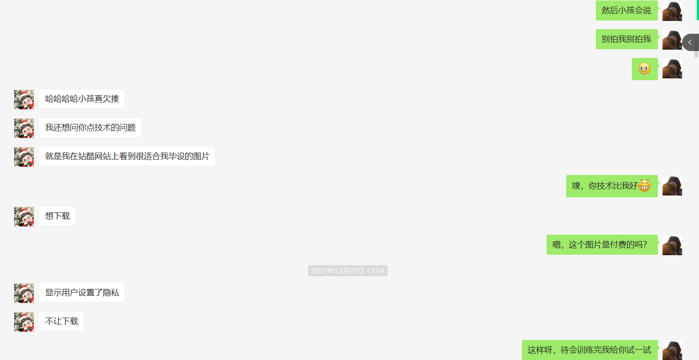
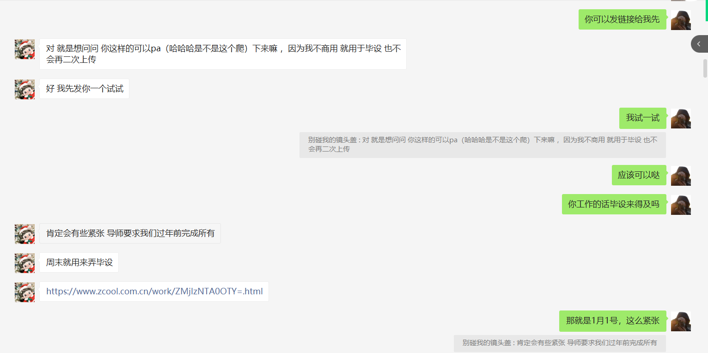
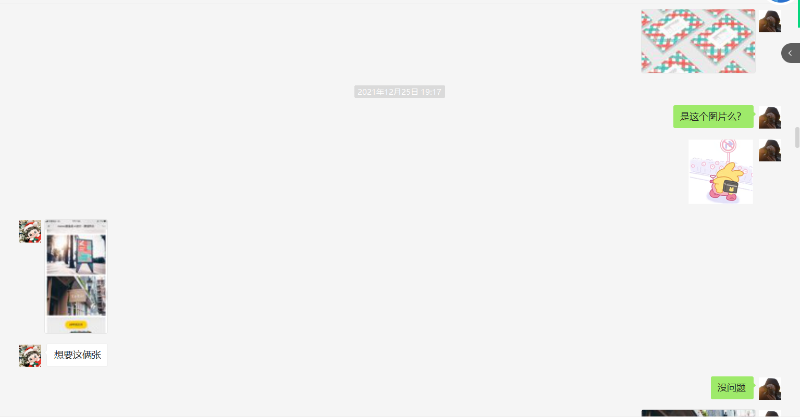
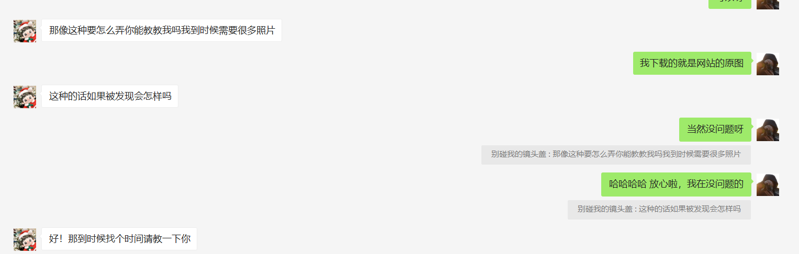
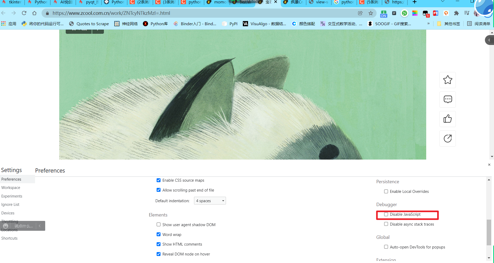
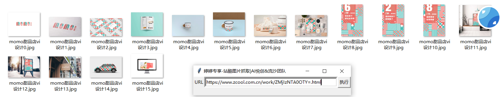
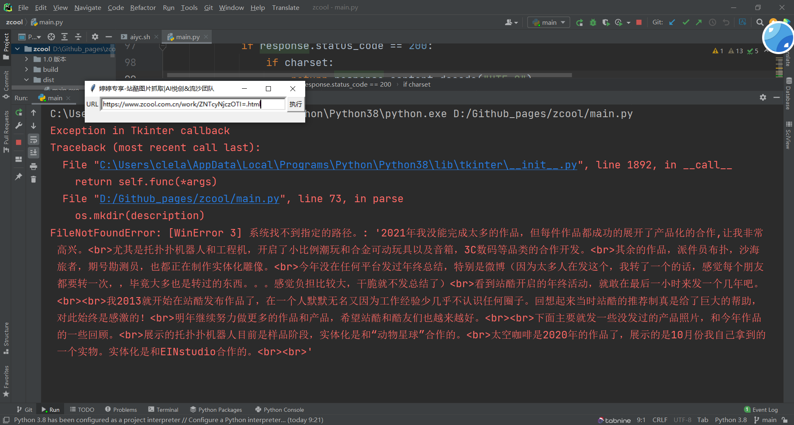

# 站酷图片爬虫+GUI

## 1. 项目的诞生

你好，我是悦创。

最近，我的女神要毕业要做毕设，需要一些站酷的图片。我来发一个聊天截图吧：







哈哈哈哈哈，高潮来了：



那我在想要不要约出来呢？不够，内心还是想的。但是还是没那么大的勇气害。。。好了，需求提了。瓜也给你们吃了，是不是得给我三连啊。。。


## 2. BASE Solution

最简单的解决方案呢，就是看网页源代码。除非像 svg 或者像下面直接复制图片得到的：

```base64

```


其实，在源码中或者在开发者工具中是可以找到这个图片的。


所以，打开开发者模式之后，直接选择图片即可。或者，直接：



但是，这样显然是有问题的。什么问题？就是：这个图片是一访问就全部加载进来的，那这样直接禁用 JS 之后，是没有问题的。但是！如果这个图片是滚轮滑动下去才能继续显示全部图片的，那就会有问题。什么问题呢？就是图片加载不全了！这样虽然能直接又键复制，但并不是非常的便捷。


## 3. 那就写个程序吧

原本是想手把手的带女神操作 2 的步骤，但是我觉得太繁琐了。所以想写个程序，直接把图片下载下来就不可以？有点舔狗的操作，但谁叫咱们愿意呢！

初期的构思是，复制 URL 然后点击执行，即可下载图片。采取正则表达式匹配，这样就避免使用解析器。

程序截图：




## 4. 开发日志

### 1.0 版本-2022年01月03日

1. 实现站酷图片抓取，放入 url 即可；
2. 代码未进行优化，模块化编程，后期考虑封装；
3. 为了方便非计算机的小伙伴使用，编写一个简单的 GUI；
4. 自动保存到 exe 当前路径下，并使用链接的  description，当作文件夹名称和图片名称；
5. 图片名称命名格式采用基本的序号增加模式；
6. 并打包成了 exe 文件；

下载地址：

[1.0 版本](https://github.com/AndersonHJB/zcool_crawler/releases/download/1.0/zcool.exe)


### 1.1 版本

1. 修复文件夹创建与存储问题：



2. 直接使用 description 当作文件夹存储有点草率，但是又不想存储成默认的啥 download 文件夹之类的，添加存储文件夹名称和默认名称；（代码添加判断文件夹是否存在）；
3. 图片存储的名称，最简单的使用是：uuid，取消 enumerate 与 index 的命名方法；
4. 优化图片后缀问题，有些图片有可能是 png 所以使用 re 匹配；
5.  错误存储功能，也就是错误日志；（待更新，下一个版本完成）


**notebook**

```python
n, ne, e, se, s, sw, w, nw, or center
north:北（n）
east：东（e）
south：南（s）
west：西（w）
```

下载链接：

[1.1 zcool.exe](https://github.com/AndersonHJB/zcool_crawler/releases/download/1.1/zcool.exe)


